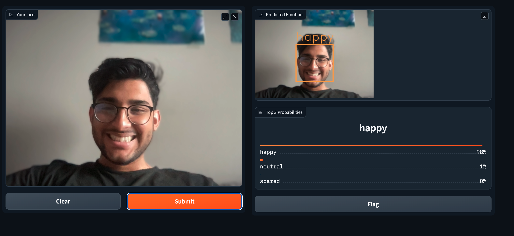

# Emotion Classifier Model (CP468 Final Project)

## Kaggle Dataset
[CK+ Dataset](https://www.kaggle.com/datasets/shuvoalok/ck-dataset)

## Emotion Classes
The model classifies the following 7 emotions:
- Anger
- Contempt
- Disgust
- Fear
- Sadness
- Happy
- Surprise

## Pre-Trained Models used in Phase Two
- VGG16 Model
- ResNet50 Model
- InceptionV3 Model

## Model Training
To review the model training process, refer to `colab.py` where the dataset is pre-processed, and a CNN is trained from scratch. This model is evaluated against an ensemble of 3 pre-trained models through various metrics like True Positive (TP), True Negative (TN), False Positive (FP), and False Negative (FN). 

Results can be shown via graphs and manual tests.

## Demo
To demo the model, please refer to `app.py`, which builds a Gradio app and integrates with Spotify to provide a preset list of playlists pertaining to each emotion.

## Instructions
1. Clone the code base `git clone https://github.com/Ved204/CP468-Facial-Recognition.git`
2. Make a virtual environment `python -m venv env` and activate `source env/bin/activate` (For Mac), Windows ([Documentation](https://docs.python.org/3/library/venv.html))
3. Install packages `pip install -r requirements.txt`
4. Now run the streamlit app using `python app.py` or `streamlit app.py`

*Note: The models should be all preloaded when app is launched and can be selected on the app (Select Model Dropdown Menu)

## References

- Lienhart, Rainer. `config/face-detector.xml`. Retrieved from [OpenCV GitHub Repository](https://github.com/opencv/opencv/tree/master/data/haarcascades) for use in facial detection projects.

## Authors
- Zaki
- Ved
- Tony
- Haseeb
